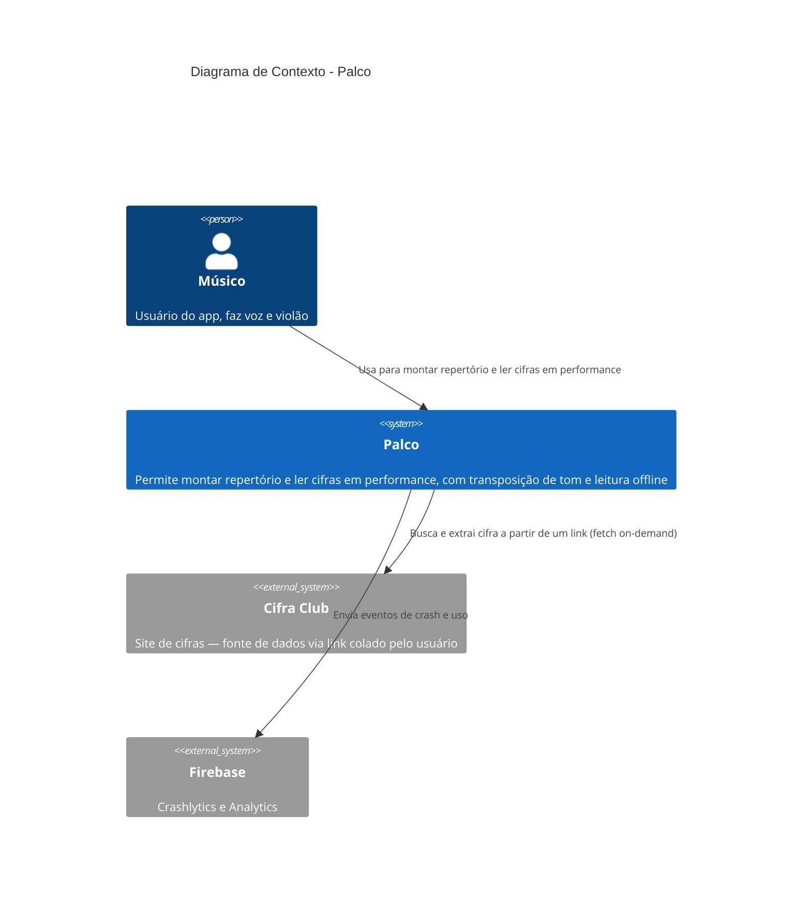
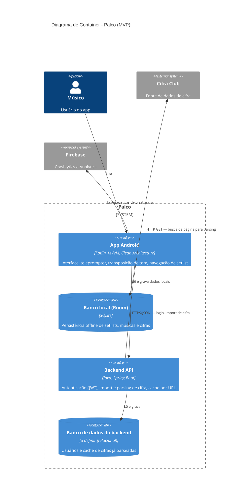

# Arquitetura do Sistema (C4) — Palco

> Fase: design de arquitetura de sistema (Nível 1 e 2 do Modelo C4).
> Disciplina correspondente: Arquitetura de Software / Projeto de Sistemas.
>
> Diferença em relação ao diagrama de camadas mostrado anteriormente na
> fase de ideação: aquele era um diagrama de Componente (Nível 3 do C4),
> mostrando as camadas *dentro* do container "App Android". Aqui estamos
> um nível acima: mostrando os containers como unidades independentes.

## Nível 1 — Diagrama de Contexto

Visão externa do sistema: quem usa e com quais sistemas externos o Palco
se comunica, sem nenhum detalhe interno.

## Nível 2 — Diagrama de Container

Abre o sistema Palco e mostra as unidades independentes (containers) que o
compõem no MVP, e como elas se comunicam.

## Notas de decisão

- O **Backend API** será construído em **Java com Spring Boot** — decisão
  alinhada ao mercado de fintech/banking (Itaú, PagBank, Cielo), reforçando
  a skill de backend Java já presente no perfil. O banco de dados
  relacional específico (PostgreSQL, MySQL) ainda será definido na fase de
  design técnico detalhado.
- O **App Android** se comunica com o **Cifra Club** apenas indiretamente,
  através do Backend API — reforça a decisão já registrada de que o
  parsing acontece no backend (ver Anexo A do PRD, decisão 2).
- O container **Room** existe dentro do boundary do Palco mas fisicamente
  vive embarcado no próprio App Android — está separado no diagrama para
  deixar explícito que é uma unidade de persistência distinta da API.
