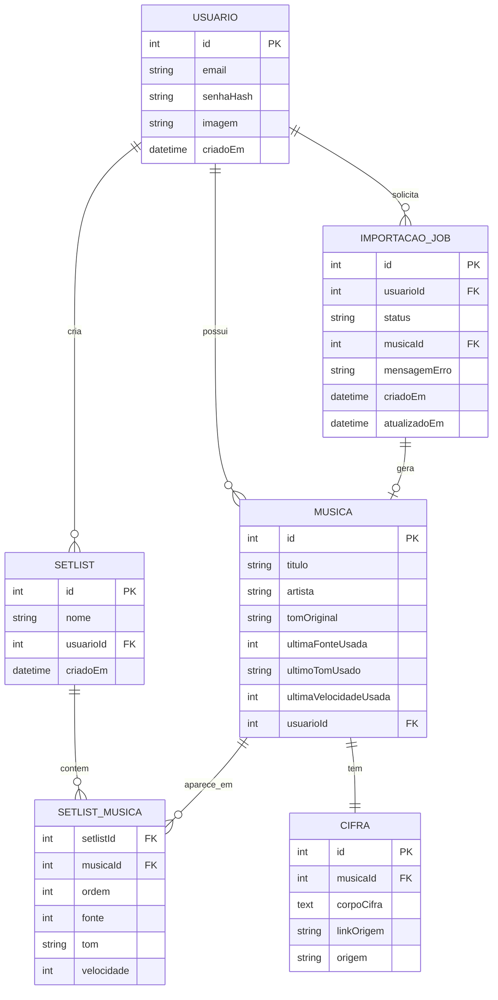

# Modelo de Domínio (ER) — Palco

> Fase: modelagem conceitual (equivalente ao conteúdo de Banco de Dados I).
> Este modelo é a fonte de referência tanto para o esquema do backend
> quanto para as entidades do Room no app Android.

## Diagrama

## Explicação das relações

1. **Usuario → Setlist (1 para 0..N):** um usuário cria zero ou várias setlists;
   cada setlist pertence a exatamente um usuário.
2. **Usuario → Musica (1 para 0..N):** um usuário possui zero ou várias músicas
   no repertório; cada música pertence a exatamente um usuário (sem
   compartilhamento de repertório entre usuários).
3. **Musica → Cifra (1 para 1):** cada música tem exatamente uma cifra, e cada
   cifra pertence a exatamente uma música. Mantidas como entidades separadas
   por decisão explícita, mesmo sendo sempre 1:1 no MVP.
4. **Setlist → SetlistMusica (1 para 0..N):** uma setlist contém zero ou várias
   linhas de associação com músicas.
5. **Musica → SetlistMusica (1 para 0..N):** uma música pode aparecer em zero
   ou várias setlists — zero é o caso de uma música buscada e tocada sem
   nunca ter sido adicionada a uma setlist (cenário de "canja").

`SETLIST_MUSICA` é a entidade associativa que resolve o relacionamento N:N
entre `SETLIST` e `MUSICA`, carregando os atributos que pertencem
especificamente à combinação das duas (ordem, fonte, tom, velocidade) —
diferente de `ultimaFonteUsada`/`ultimoTomUsado`/`ultimaVelocidadeUsada` em
`MUSICA`, que representam o último estado usado independente de setlist
(decisão registrada no PRD, RF-15).

6. **Usuario → ImportacaoJob (1 para 0..N):** um usuário pode solicitar
   zero ou várias importações de cifra; cada job pertence a exatamente
   um usuário.
7. **ImportacaoJob → Musica (1 para 0..1):** um job de importação gera,
   no máximo, uma música (zero enquanto ainda está `pendente`/
   `processando`, ou se `falhou`; exatamente uma quando `concluido`).
   `ImportacaoJob` foi introduzida pela decisão de processamento
   assíncrono da importação (ver ADR-006) — não existia na versão
   síncrona original do modelo.

## Nota de nomenclatura

A entidade originalmente chamada "Lista" foi renomeada para "Setlist" para
evitar colisão com o tipo nativo `List<T>` de Kotlin/Java e ambiguidade
semântica com "repertório" (a totalidade de músicas do usuário).
